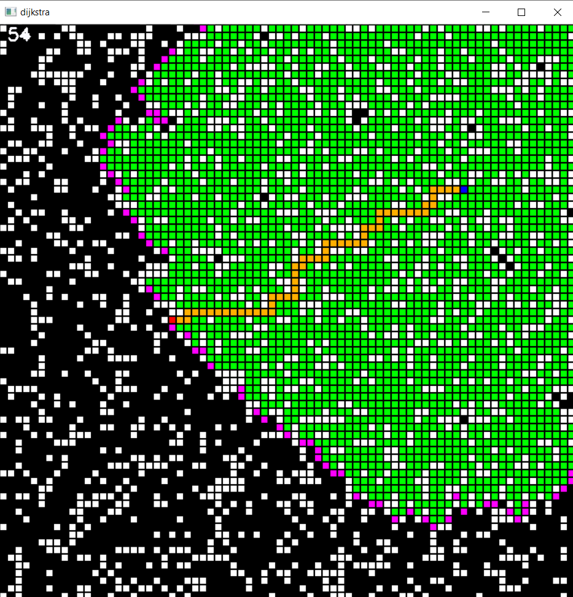
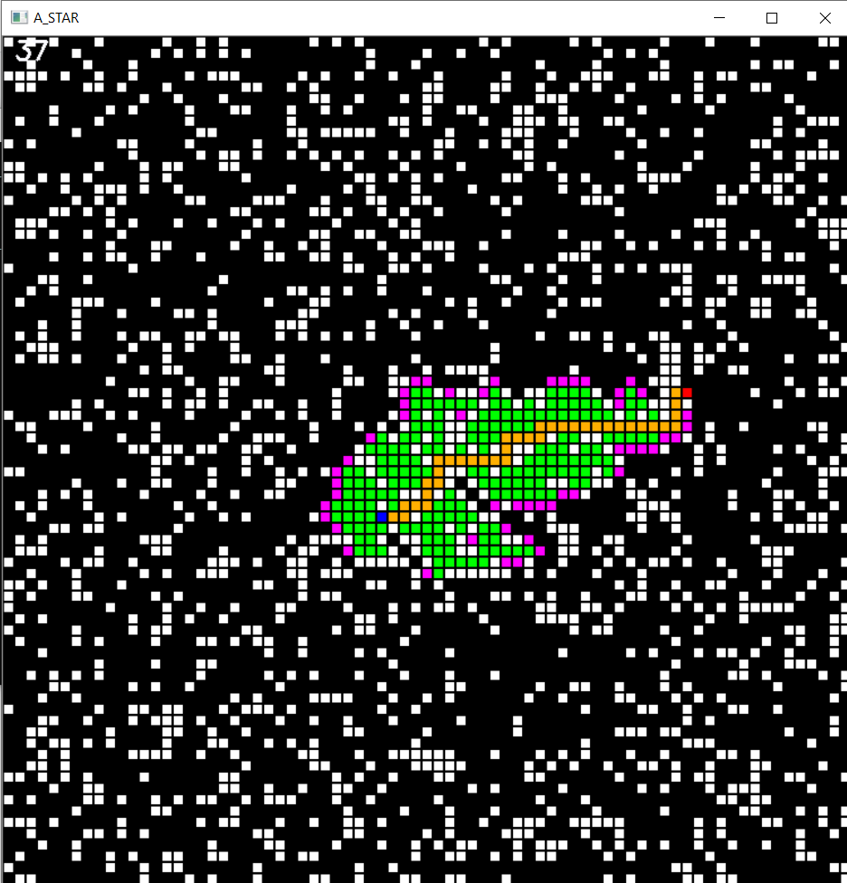
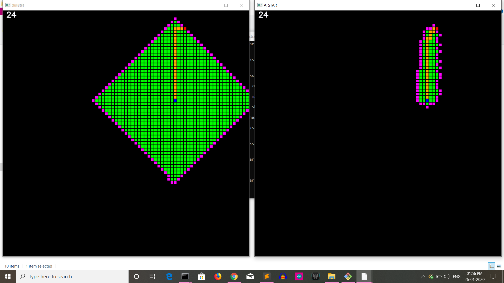

# shortest-path
Implementation of algorithms for finding the shortest paths between nodes in a graph .

## Installation
clone this repository and execute the following commands:
   ### to install requirements:
          pip install -r requirements.txt 
   ### to try the codes:
   ####        1.Dijkstra algorithm
          python dijkstra.py
   ####        2.Astar algorithm
          python Astar.py
                 
   ####        2.comparision between dijkstra and Astar
          python astar_vs_dijkstra.py
                 
                 
## Screen-shots
 

